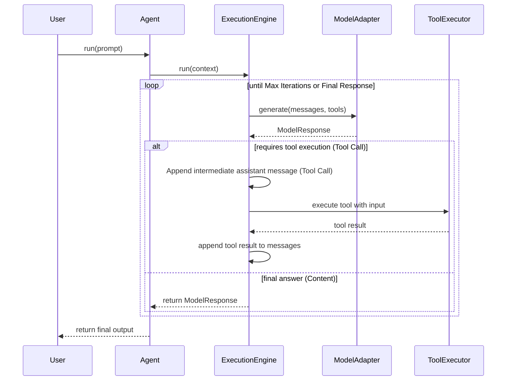

# Agent88 Architecture

## Core Layers

### Agent Runtime Layer

The public API that developers interact with.

Handles:
* Agent lifecycle
* Tool registration
* Memory integration
* Delegating work to the Execution Engine

**Design Protocol:** The Agent follows the Dependency Inversion principle. It does not run models directly, nor execute tools. Instead, it acts purely as an orchestrator tying dependencies together and resolving memory.

Example Usage:
```typescript
const agent = new Agent({
    model: new OpenAIModel({ apiKey: "..." }),
    systemPrompt: "You are a helpful assistant.",
    maxIterations: 5
});

agent.registerTool(searchTool);

const finalResponse = await agent.run("What's the weather like?");
```

---

### Execution Engine Layer

The central brain of Agent88 that manages the interaction between the LLM and the tools.

Responsibilities:
* Sending prompts and tool metadata to the model
* Detecting tool calls requested by the model
* Executing tools safely via the `ToolExecutor`
* Re-feeding tool execution results back to the model
* Managing reasoning loops and iteration limits
* Returning final output

#### Execution Engine Flow



---

### Tool Layer

This layer tracks and safely executes external capabilities via tools. It consists of:
* **ToolRegistry**: Manages registering tools, preventing duplicated tool names, and retrieving active tools to expose structural metadata to the execution engine.
* **ToolExecutor**: Safely wraps and executes tool implementation logic, captures potential errors, and formats tool output seamlessly for the model.

Example:

```ts
agent.registerTool("search", async () => {})
```

---

### Model Adapter Layer

Abstracts away specific LLM providers, allowing developers to switch models seamlessly without changing core application logic. 

Supported implementations will include:
* **MockModel**: Built-in mock model for running robust layout tests, tool verification, and iterations without incurring expensive API fees.
* **OpenAIModel / AnthropicModel**: (Future) Real LLM providers.

---

### Memory Layer

The memory layer is cleanly abstracted via the `BaseMemory` and `MemoryAdapter` interfaces, allowing conversational context to be saved and loaded across LLM interactions.

Concrete backend implementations will be able to support:
* **In-Memory**: Volatile storage for simple sessions.
* **Redis storage**: Distributed caching.
* **Database persistence**: Long-term state tracking.
