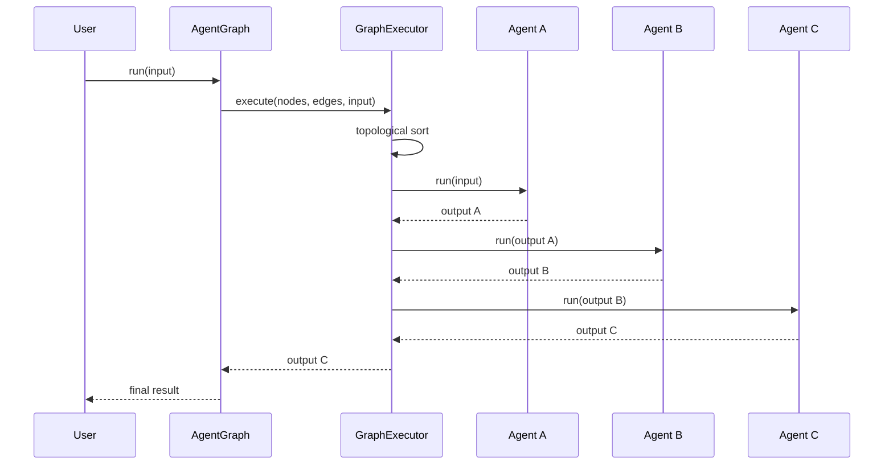
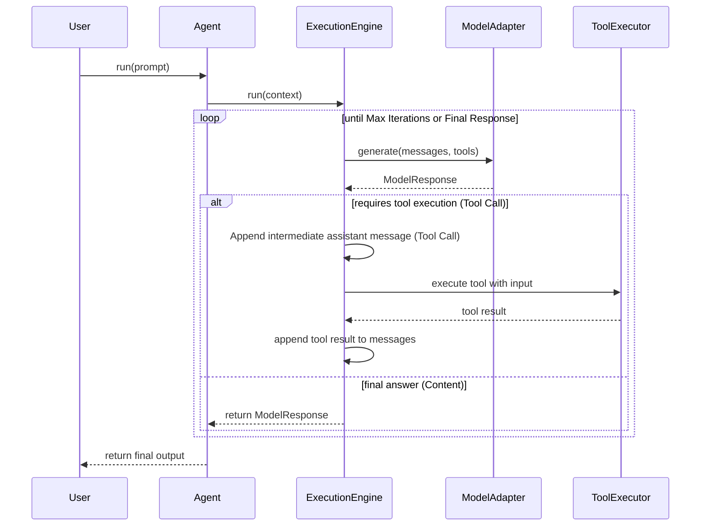

# Agent88 Architecture

## Core Layers

### Agent Runtime Layer

The public API that developers interact with.

Handles:
* Agent lifecycle
* Tool registration
* Memory integration and context tracking
* Middleware interceptors (`agent.use()`)
* Text streaming generators (`agent.stream()`)
* Delegating work to the Execution Engine

**Design Protocol:** The Agent follows the Dependency Inversion principle. It does not run models directly, nor execute tools. Instead, it acts purely as an orchestrator tying dependencies together and resolving memory.

Example Usage:
```typescript
const agent = new Agent({
    model: new OpenAIModel("sk-...", "gpt-4o-mini"),
    systemPrompt: "You are a helpful assistant.",
    maxIterations: 5
});

agent.registerTool(searchTool);

const finalResponse = await agent.run("What's the weather like?", "session_123");

// Streaming approach:
const stream = agent.stream("Tell me a story", "session_123");
for await (const chunk of stream) {
    process.stdout.write(chunk);
}
```

---

### Agent Graph Orchestration Layer

Agent88 supports multi-agent workflows via the `AgentGraph` class. Compose multiple specialized agents into a directed acyclic graph (DAG) where the output of one agent feeds into the next.

```typescript
import { Agent, AgentGraph, OpenAIModel } from "agent88";

const graph = new AgentGraph();

graph.add("research", researchAgent);
graph.add("analysis", analysisAgent);
graph.add("summary", summaryAgent);

graph.connect("research", "analysis");
graph.connect("analysis", "summary");

const result = await graph.run("Explain quantum computing");
```

**Architecture:**

| Component       | Responsibility                                               |
| --------------- | ------------------------------------------------------------ |
| `GraphNode`     | Binds a string `id` to an `Agent` instance                   |
| `GraphEdge`     | Directed edge defining flow (`from` → `to`)                  |
| `AgentGraph`    | Developer API: `add()`, `connect()`, `run()` with validation |
| `GraphExecutor` | Topological sort (Kahn's algorithm) + cycle detection        |

**Memory Model:** Each agent in the graph has its own isolated memory. Data flows between agents purely through output piping — one agent's return value becomes the next agent's prompt. Agents never share memory state directly.

#### Agent Graph Flow



---

### Middleware Pipeline

Agent88 uses an Express/Koa style **Onion Routing pattern** to intercept the `ExecutionEngine`.

This allows developers to securely wrap the core reasoning loop to inject system prompts, enforce guardrails, or log events *before* and *after* the model executes.

```ts
agent.use(async (ctx, next) => {
    console.log("Before execution (Context state):", ctx.messages);
    
    await next(); // Await the innermost core loop

    console.log("After execution (Final Result):", ctx.response);
});
```

---

### Observability Layer

Agent88 comes with built-in instrumentation via the `Trace` object (available on the `ExecutionContext`). This allows developers to easily extract timings and events from any Agent run without configuring external telemetry systems immediately.

The `Trace` records the exact millisecond duration of:
* Full Model Generation turns
* Individual Tool Executions

Extract these inside your middleware:

```ts
agent.use(async (ctx, next) => {
    await next();
    
    // Dump structured timeline data after run completion
    console.table(ctx.trace.getEvents()); 
});
```

---

### Streaming Layer

Agent88 supports native text streaming via the `agent.stream()` async generator, allowing token-by-token delivery to consumers.

Streaming is enabled by the optional `generateStream()` method on the `BaseModel` interface. Model adapters that implement this method (such as `OpenAIModel`) can be used with `agent.stream()`. If the active model does not support streaming, an error is thrown immediately.

> **v0.1 Note:** Streaming currently bypasses the `ExecutionEngine` tool execution loop and delegates directly to the model. This means streamed responses cannot trigger tool calls. Full agentic streaming is planned for a future version.

```ts
const stream = agent.stream("Tell me a story", "session_123");
for await (const chunk of stream) {
    process.stdout.write(chunk);
}
```

---

### Execution Engine Layer

The central brain of Agent88 that manages the interaction between the LLM and the tools.

Responsibilities:
* Sending prompts and tool metadata to the model
* Detecting tool calls requested by the model
* Executing tools safely via the `ToolExecutor`
* Re-feeding tool execution results back to the model
* Managing reasoning loops and iteration limits
* Composing the middleware pipeline (onion routing) around the core loop
* Returning final output

#### Execution Engine Flow



#### ExecutionContext

The `ExecutionContext` is the shared state object threaded through the middleware pipeline and the core loop:

| Field           | Type             | Description                                                       |
| --------------- | ---------------- | ----------------------------------------------------------------- |
| `messages`      | `Message[]`      | The conversation history (mutated during execution)               |
| `tools`         | `Tool[]`         | Tools registered with the agent                                   |
| `maxIterations` | `number?`        | Iteration limit for the reasoning loop                            |
| `response`      | `ModelResponse?` | Populated by the core loop; readable by middleware after `next()` |

---

### Tool Layer

This layer tracks and safely executes external capabilities via tools. It consists of:
* **ToolRegistry**: Manages registering tools, preventing duplicated tool names, and retrieving active tools to expose structural metadata to the execution engine.
* **ToolExecutor**: Safely wraps and executes tool implementation logic, captures potential errors, and formats tool output seamlessly for the model.

**JSON Schema Support**: Tools define a strict `parameters?: Record<string, any>` JSONSchema which is natively forwarded to the active `ModelAdapter` layer, guaranteeing models format their nested arguments rigorously.

Example:

```ts
agent.registerTool({
    name: "search",
    description: "Search the web",
    parameters: { type: "object", properties: { query: { type: "string" } } },
    execute: async ({ query }) => `Results for ${query}...`
});
```

---

### Model Adapter Layer

Abstracts away specific LLM providers, allowing developers to switch models seamlessly without changing core application logic. All adapters implement the `BaseModel` interface, which requires a `generate()` method and an optional `generateStream()` method for streaming support.

Current implementations:
* **MockModel**: Built-in mock model for running robust unit tests, tool verification, and iteration logic without incurring API fees.
* **OpenAIModel**: Concrete adapter supporting full recursive conversation loops, structured tool execution via the OpenAI Chat Completions API, and native token streaming via `generateStream()`.
* **GeminiModel**: Google Gemini adapter with full tool execution and streaming support. Bridges Protobuf struct constraints under the `@google/generative-ai` SDK.
* **OllamaModel**: Local LLM execution via Ollama's Chat API. Zero external dependencies — uses native `fetch`. Includes `checkConnection()` for service health checks, full tool execution, and streaming.

Future:
* **AnthropicModel**: Claude 3.5 family (cloud)

---

### Memory Layer

The memory layer is cleanly abstracted via the `MemoryAdapter` interface, allowing conversational context to be natively synchronized across LLM interactions.

Crucially, **memory persistence requires a `contextId`** explicitly defining which user/session the interactions belong to. `agent.run` and `agent.stream` automatically resolve memory using the passed `contextId`.

Current implementations:
* **InMemoryMemory**: Built-in volatile map storage for simple node instances and rigorous testing.
* **RedisMemory**: Distributed cache via `ioredis` for multi-node deployments and stateless horizontal scaling. Accepts an existing `Redis` instance, a connection string, or `RedisOptions`.

Future:
* **PostgreSQL/MongoDB**: Long-term state tracking.
