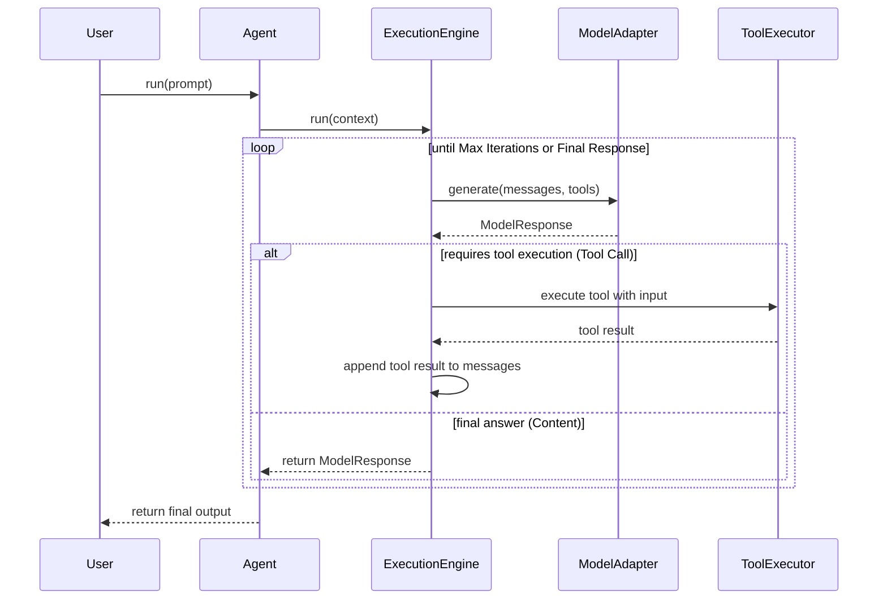

# Agent88 Architecture

## Core Layers

### Agent Runtime Layer

The public API that developers interact with.

Handles:
* Agent lifecycle
* Tool registration
* Memory integration
* Delegating work to the Execution Engine

---

### Execution Engine Layer

The central brain of Agent88 that manages the interaction between the LLM and the tools.

Responsibilities:
* Sending prompts and tool metadata to the model
* Detecting tool calls requested by the model
* Executing tools safely via the `ToolExecutor`
* Re-feeding tool execution results back to the model
* Managing reasoning loops and iteration limits
* Returning final output

#### Execution Engine Flow



---

### Tool Execution Layer

Allows developers to register external tools which are then executed by the engine's `ToolExecutor`.

Example:

```ts
agent.registerTool("search", async () => {})
```

---

### Model Adapter Layer

Abstracts away specific LLM providers (e.g., OpenAI, Anthropic), allowing developers to swich models seamlessly without changing core application logic.

---

### Memory Layer (Future)

Will support persisting conversational context across sessions.

Supported backends will include:
* Redis storage
* Database persistence
