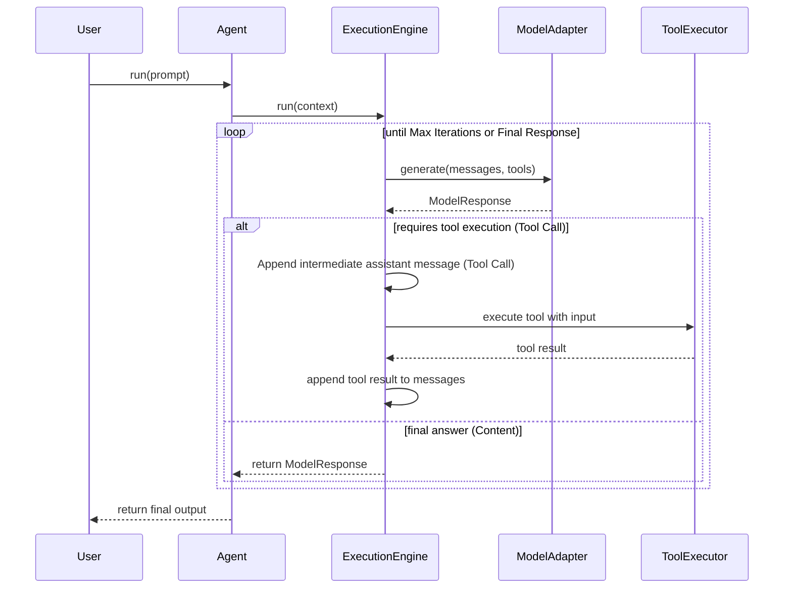

# Agent88 Architecture

## Core Layers

### Agent Runtime Layer

The public API that developers interact with.

Handles:
* Agent lifecycle
* Tool registration
* Memory integration and context tracking
* Middleware interceptors (`agent.use()`)
* Text streaming generators (`agent.stream()`)
* Delegating work to the Execution Engine

**Design Protocol:** The Agent follows the Dependency Inversion principle. It does not run models directly, nor execute tools. Instead, it acts purely as an orchestrator tying dependencies together and resolving memory.

Example Usage:
```typescript
const agent = new Agent({
    model: new OpenAIModel({ apiKey: "..." }),
    systemPrompt: "You are a helpful assistant.",
    maxIterations: 5
});

agent.registerTool(searchTool);

const finalResponse = await agent.run("What's the weather like?", "session_123");

// Streaming approach:
const stream = agent.stream("Tell me a story", "session_123");
for await (const chunk of stream) {
    process.stdout.write(chunk);
}
```

---

### Middleware Pipeline

Agent88 uses an Express/Koa style **Onion Routing pattern** to intercept the `ExecutionEngine`.

This allows developers to securely wrap the core reasoning loop to inject system prompts, enforce guardrails, or log events *before* and *after* the model executes.

```ts
agent.use(async (ctx, next) => {
    console.log("Before execution (Context state):", ctx.messages);
    
    await next(); // Await the innermost core loop

    console.log("After execution (Final Result):", ctx.response);
});
```

---

### Execution Engine Layer

The central brain of Agent88 that manages the interaction between the LLM and the tools.

Responsibilities:
* Sending prompts and tool metadata to the model
* Detecting tool calls requested by the model
* Executing tools safely via the `ToolExecutor`
* Re-feeding tool execution results back to the model
* Managing reasoning loops and iteration limits
* Returning final output

#### Execution Engine Flow



---

### Tool Layer

This layer tracks and safely executes external capabilities via tools. It consists of:
* **ToolRegistry**: Manages registering tools, preventing duplicated tool names, and retrieving active tools to expose structural metadata to the execution engine.
* **ToolExecutor**: Safely wraps and executes tool implementation logic, captures potential errors, and formats tool output seamlessly for the model.

**JSON Schema Support**: Tools define a strict `parameters?: Record<string, any>` JSONSchema which is natively forwarded to the active `ModelAdapter` layer, guaranteeing models format their nested arguments rigorously.

Example:

```ts
agent.registerTool({
    name: "search",
    description: "Search the web",
    parameters: { type: "object", properties: { query: { type: "string" } } },
    execute: async ({ query }) => `Results for ${query}...`
});
```

---

### Model Adapter Layer

Abstracts away specific LLM providers, allowing developers to switch models seamlessly without changing core application logic. 

Supported implementations will include:
* **MockModel**: Built-in mock model for running robust layout tests, tool verification, and iterations without incurring expensive API fees.
* **OpenAIModel**: A concrete adapter enabling full-featured recursive conversation loops and bridging structured tool execution natively via the OpenAI Chat Completions API.
* **AnthropicModel**: (Future) Real LLM provider for Claude models.

---

### Memory Layer

The memory layer is cleanly abstracted via the `MemoryAdapter` interface, allowing conversational context to be natively synchronized across LLM interactions.

Crucially, **memory persistence requires a `contextId`** explicitly defining which user/session the interactions belong to. `agent.run` and `agent.stream` automatically resolve memory using the passed `contextId`.

Concrete backend implementations include:
* **InMemoryMemory**: Built-in volatile map storage for simple node instances and rigorous testing.
* **RedisMemory**: Distributed cache mapping via `ioredis` for multi-node deployments and stateless horizontal scaling.
* *(Future Support)* **PostgreSQL/MongoDB**: Long-term state tracking.
